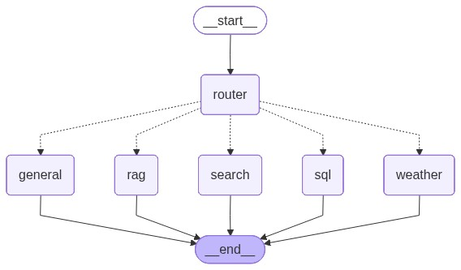

# Multi-Tool Agentic AI — Electronics Retail Assistant

A fully-routed multi-agent system built with **LangGraph**, designed for an electronics retail company. The system routes each user message to one of five specialised agent nodes — weather, web search, RAG retrieval, Text-to-SQL, or general LLM — and maintains conversation memory that persists across application restarts.

Built as Final Assignment for the "AI Hands-On" course.



---

## Table of Contents

1. [System Overview](#1-system-overview)
2. [Setup Instructions](#2-setup-instructions)
3. [How to Run](#3-how-to-run)
4. [Knowledge Base — Feature 2](#4-knowledge-base--feature-2)
5. [Database — Feature 3](#5-database--feature-3)
6. [Router Test Cases — Feature 4](#6-router-test-cases--feature-4)
7. [Conversation Memory — Feature 5](#7-conversation-memory--feature-5)
8. [Streamlit UI](#8-streamlit-ui)
9. [REST API](#9-rest-api-optional-extra)
10. [Project Structure](#10-project-structure)

---

## 1. System Overview

The graph has a single entry point (`router`) which classifies every incoming message and dispatches it to the correct agent node via LangGraph conditional edges. Every node shares the same `AgentState` and receives the same rolling conversation history (Feature 5), so context references work regardless of which node handles a turn.

| Node | File | Description |
|------|------|-------------|
| **router** | `src/router.py` | Single `temperature=0` LLM call with a few-shot prompt classifies the message into one of five route labels: `weather`, `search`, `rag`, `sql`, `general`. Falls back to `general` on any ambiguous or unparseable output. |
| **weather** | `src/agents/weather_agent.py` | Extracts the city from the user's message, queries the free Open-Meteo API (no key required), and generates a natural-language answer with a brief retail impact note (footfall / deliveries). |
| **search** | `src/agents/search_agent.py` | Calls the Tavily Search API for time-sensitive external information (news, current prices, market trends). Returns inline `[1][2]` citations. Gracefully handles empty or low-relevance results without hallucinating. |
| **rag** | `src/agents/rag_agent.py` | Retrieves the top-k most relevant chunks from a persisted ChromaDB collection of internal store policy documents and answers strictly from those chunks. Claims not supported by the retrieved context are not made. |
| **sql** | `src/agents/sql_agent.py` | Generates a SQLite `SELECT` query from the user's question, validates it is read-only, executes it against `data/database.db`, and explains the result in natural language. Blocked keywords (`DROP`, `DELETE`, `UPDATE`, `INSERT`, `ALTER`, `TRUNCATE`) are rejected before execution. |
| **general** | `src/agents/general_agent.py` | Catch-all LLM node for general knowledge, definitions, and follow-up questions. Receives the same rolling conversation history as every other node. |

### Graph

The compiled LangGraph graph with all nodes and conditional edges:


---

## 2. Setup Instructions

### Requirements

- Python 3.12
- A [Groq API key](https://console.groq.com) (free)
- A [Tavily API key](https://tavily.com) (free tier available)

### Installation

```bash
# 1. Clone the repository
git clone <your-repo-url>
cd electronics-agentic-ai

# 2. Create and activate a virtual environment (Python 3.12)
py -3.12 -m venv .venv312
.venv312\Scripts\activate        # Windows
# source .venv312/bin/activate   # macOS / Linux

# 3. Install dependencies
pip install -r requirements.txt

# 4. Set API keys
cp .env.example .env
# Edit .env and fill in:
#   GROQ_API_KEY=gsk_...
#   TAVILY_API_KEY=tvly-...
```

### One-time setup (run once, in order)

```bash
# Build the SQLite sales database (Feature 3)
python scripts/build_database.py

# Build the ChromaDB vector store from the knowledge base (Feature 2)
python scripts/ingest_kb.py

# Generate the LangGraph visualisation (required deliverable)
python scripts/visualize_graph.py
```

---

## 3. How to Run

### CLI

```bash
python main.py

# Resume an existing conversation
python main.py --conversation-id <id>

# Adjust rolling history window (default: 6 messages)
python main.py --history-turns 10
```

The conversation ID is printed when a new session starts. Type `exit` or `quit` to end the session.

### Streamlit UI (recommended)

```bash
streamlit run app.py
```

Opens automatically at `http://localhost:8501`. Features a chat interface with colour-coded route badges, a sidebar for resuming conversations, and one-click example questions.

---

## 4. Knowledge Base — Feature 2

**Domain:** Electronics retail store — internal policy documents.

Five documents in `data/knowledge_base/`:

| File | Format | Content |
|------|--------|---------|
| `returns_policy.md` | Markdown | 14-day return window, opened vs. sealed products, refund timeline |
| `warranty_policy.md` | Markdown | 24-month EU warranty, exclusions (physical damage, wear), claim process |
| `shipping_policy.md` | Markdown | Delivery times, free shipping threshold (€50), express same-day, weather delays |
| `loyalty_program.md` | Markdown | Points accrual (1pt/€1), tiers (Silver / Gold / Platinum), expiry rules |
| `click_and_collect_policy.pdf` | PDF | In-store pickup window (5 days), authorised collector rules |

**Ingestion pipeline** (`scripts/ingest_kb.py`):
- Loads `.md` files with plain-text reading and `.pdf` files with `pypdf`
- Chunks at 600 characters with 100-character overlap
- Embeds with `sentence-transformers/all-MiniLM-L6-v2`
- Stores in a persisted ChromaDB collection at `chroma_db/`

The index is built once and loaded from disk on every subsequent run — documents are never re-embedded on startup.

---

## 5. Database — Feature 3

**Domain:** Electronics retail sales data.

**Schema** (`data/schema.sql`):

```sql
stores   (store_id, store_name, city, region)
products (product_id, name, category, price, store_id → stores)
sales    (sale_id, product_id → products, sale_date, quantity, total_amount)
```

**Sample data** (seeded by `scripts/build_database.py`):

| Table | Rows |
|-------|------|
| stores | 5 |
| products | 75 |
| sales | 220 |

**Example queries**

| Question | Generated SQL | Result |
|----------|--------------|--------|
| Which product category had the highest revenue? | `SELECT category, SUM(total_amount) as rev FROM sales s JOIN products p ON s.product_id=p.product_id GROUP BY category ORDER BY rev DESC LIMIT 1` | Laptops — €97,684.29 |
| How many stores do we have in total? | `SELECT COUNT(*) FROM stores` | 5 |

**Safety validation** (`src/tools/sql_tool.py`):

The validation layer rejects any query that:
- Contains a blocked keyword: `DROP`, `DELETE`, `UPDATE`, `INSERT`, `ALTER`, `TRUNCATE`
- Does not start with `SELECT` or `WITH`
- Contains multiple statements (`;` separator)

As defense-in-depth, the SQLite connection is also opened read-only (`mode=ro`).

---

## 6. Router Test Cases — Feature 4

The router uses a single `temperature=0` LLM call with a structured few-shot prompt (5 examples per route). It does not use keyword matching.

Run `python scripts/test_router.py` to reproduce this table live.

| # | Input Message | Expected | Actual | Match |
|---|---------------|----------|--------|-------|
| 1 | What is the weather in Athens tomorrow? | weather | weather | ✅ |
| 2 | Θα κάνει ζέστη στη Θεσσαλονίκη αυτή την εβδομάδα; | weather | weather | ✅ |
| 3 | What's the rain forecast for Patras? | weather | weather | ✅ |
| 4 | What are the latest smartphone price trends? | search | search | ✅ |
| 5 | Υπάρχουν πρόσφατα νέα για τιμές laptop; | search | search | ✅ |
| 6 | Any recent news on electronics import tariffs? | search | search | ✅ |
| 7 | What is the warranty period for laptops? | rag | rag | ✅ |
| 8 | Ποια είναι η πολιτική επιστροφών σας; | rag | rag | ✅ |
| 9 | How does the loyalty points program work? | rag | rag | ✅ |
| 10 | What's the click and collect pickup window? | rag | rag | ✅ |
| 11 | What were total sales last month? | sql | sql | ✅ |
| 12 | Ποιο κατάστημα είχε τα περισσότερα έσοδα; | sql | sql | ✅ |
| 13 | How many smartphones have we sold in Athens? | sql | sql | ✅ |
| 14 | Explain what LangGraph is. | general | general | ✅ |

**Accuracy: 14/14 (100%)**

---

## 7. Conversation Memory — Feature 5

### 5a — In-session memory

Every user message and agent response is stored in the LangGraph state. Before each agent node runs, the last N turns (default N=6, configurable via `--history-turns`) are retrieved from the database and prepended to the prompt. This allows the agent to resolve references to earlier messages regardless of which node handles the current turn.

**Example transcript:**

| Turn | Role | Message |
|------|------|---------|
| 1 | User | My favourite city is Athens. |
| 1 | Agent [general] | That's a great choice. Athens is a city steeped in history and culture. What is it about Athens that makes it your favourite city? |
| 2 | User | What city did I tell you I like? |
| 2 | Agent [general] | You told me that your favourite city is Athens. |

### 5b — Database persistence

All conversation data is stored in `data/conversations.db` (SQLite) via a dedicated module (`src/memory.py`). No SQL queries appear in any agent node file — all database logic is isolated in `src/memory.py`.

**Schema:**

```sql
conversations (conversation_id TEXT PK, created_at TEXT, updated_at TEXT)
messages      (message_id INT PK, conversation_id TEXT FK, role TEXT,
               content TEXT, timestamp TEXT)
```

**Resume workflow:**

```bash
# End the session (Ctrl+C or type 'exit')
# Restart with the same conversation ID:
python main.py --conversation-id 90c68089
```

**Example persistence transcript:**

| Turn | Role | Message |
|------|------|---------|
| *(previous session)* | User | My favourite city is Athens. |
| *(previous session)* | User | What city did I tell you I like? |
| *(after restart)* | User | What did I just ask about? |
| *(after restart)* | Agent [general] | You just asked about the city you mentioned as your favourite, and I reminded you that it was Athens. |

---

## 8. Streamlit UI

An interactive chat interface built with Streamlit, wrapping the same LangGraph graph and memory layer used by the CLI.

```bash
streamlit run app.py
```

Opens at `http://localhost:8501`.

**Features:**
- Chat interface with colour-coded route badges (🌤 Weather, 🔍 Web Search, 📄 Policy Docs, 🗄 Sales Data, 💬 General)
- Sidebar showing the active conversation ID
- Resume any past conversation by pasting its ID
- New conversation button
- One-click example questions for each route

---

## 9. REST API (Optional Extra)

The same graph is also exposed as a REST API via FastAPI.

```bash
uvicorn api:app --reload
```

Interactive docs at `http://127.0.0.1:8000/docs`.

| Method | Endpoint | Description |
|--------|----------|-------------|
| GET | `/health` | Health check |
| POST | `/chat` | Send a message. Body: `{"message": str, "conversation_id": str or null}` |
| GET | `/conversations/{id}/history` | Full stored history for a conversation |

---

## 10. Project Structure

```
electronics-agentic-ai/
├── main.py                       # CLI entry point with conversation loop
├── app.py                        # Streamlit chat UI
├── api.py                        # Optional REST API (FastAPI)
├── src/
│   ├── state.py                  # Shared AgentState TypedDict schema
│   ├── llm.py                    # Groq LLM client wrapper (single call_llm function)
│   ├── router.py                 # Feature 4: intent classification
│   ├── memory.py                 # Feature 5: ALL database reads/writes (isolated)
│   ├── graph.py                  # LangGraph graph: nodes + conditional edges
│   ├── agents/
│   │   ├── weather_agent.py      # Baseline weather node
│   │   ├── search_agent.py       # Feature 1: web search node
│   │   ├── rag_agent.py          # Feature 2: RAG retrieval node
│   │   ├── sql_agent.py          # Feature 3: Text-to-SQL node
│   │   └── general_agent.py      # Baseline general LLM node
│   └── tools/
│       ├── weather.py            # Open-Meteo API wrapper
│       ├── search.py             # Tavily search wrapper
│       ├── rag.py                # ChromaDB retrieval wrapper
│       └── sql_tool.py           # SQL validation + execution
├── scripts/
│   ├── build_database.py         # Builds and seeds data/database.db
│   ├── ingest_kb.py              # Builds chroma_db/ from data/knowledge_base/
│   ├── visualize_graph.py        # Generates results/graph.png (required)
│   └── test_router.py            # Generates the router accuracy table
├── data/
│   ├── knowledge_base/           # RAG source documents (4x .md + 1x .pdf)
│   ├── schema.sql                # SQL schema creation script
│   ├── database.db               # Seeded SQLite sales database
│   └── conversations.db          # Conversation history (auto-created on first run)
├── chroma_db/                    # Persisted ChromaDB vector store (auto-built)
├── results/
│   └── graph.png                 # LangGraph graph visualisation (required deliverable)
├── requirements.txt
├── .env.example                  # Template — copy to .env and fill in API keys
└── README.md
```

---

## Dependencies

| Package | Purpose |
|---------|---------|
| `langgraph` | Graph orchestration framework |
| `langchain`, `langchain-core`, `langchain-community` | LangChain core utilities |
| `groq` | LLM provider (Llama 3.1 via Groq API) |
| `tavily-python` | Web search API (Feature 1) |
| `chromadb` | Persisted vector store (Feature 2) |
| `sentence-transformers` | Embedding model for RAG (Feature 2) |
| `pypdf` | PDF text extraction for KB ingestion (Feature 2) |
| `requests` | HTTP calls for Open-Meteo weather API |
| `python-dotenv` | `.env` file loading |
| `pydantic`, `typing-extensions` | Type validation and TypedDict compatibility |
| `streamlit` | Chat UI |
| `fastapi`, `uvicorn` | REST API (optional extra) |
